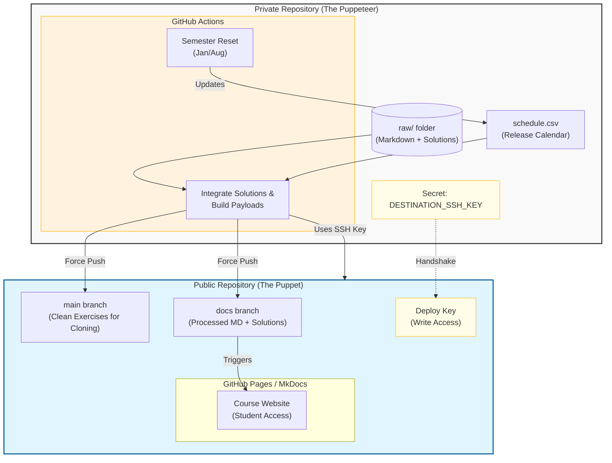

Welcome to the CoursePuppeteer repository!
It is a course-management framework for quickly hosting course content on GitHub Pages. 
Specifically, we contribute with the following features: 
- A web-page front-end, which allows students to get a quicker overview of exercises quickly
- Automatic integration of solutions depending on a release-schedule 
- GitHub actions infrastructure to push exercises with solutions automatically to the public repository accessable by students. 

All changes to course material (exercises, solutions, etc.) are to be made in this repository. They are automatically pushed to the public repository based on time-schedules. 


# ⚡ Quick Reference: I just want to fix a typo
1. Pull the latest code: git pull origin main
2. Fix the file in raw/
3. Commit & Push: git add . && git commit -m "fix: typo in ex1" && git push
4. Wait 5 mins and check the Actions tab - check that nothing failed.
5. Check out the public coursesite. 


# Detailed technical overview 
The design philosophy behind the new course exercise infrastructure is based on two repositories: 
- A public repository, accessable by the students, which serves the webpage and course content for git cloning in a consistent format with the earlier version. This repository is termed the ***public repository*** in the following, and is to be considered a puppet. 
- A ***private repository*** (this one), controlling all aspects of the public repository, much like a puppeteer would control a puppet.

All interaction between the two repositories is maintained by github actions in a completely automatic fashion. 


# General principles of use 
- All exercise data and files are located in the raw/ directory. 
- All your pushes are to be made to the private main branch. This activates all automatic workflows. 
- After each push, check the "actions" tab and check that the action "Integrate solutions and push to public" did not fail. If it failed, click on it and check why it failed - it is probably because one of the solution-validation steps failed. 
- NEVER touch anything else than stuff in the raw/ directory unless you explicitly know what you are doing.
- NEVER change files directly in the public branch - they will be overwritten by force automatically at the next scheduled workflow. All changes should be made on the private branch. 

In the following sections, the general workflow will be outlined as a reference for TAs.
Start out by cloning this repository. 

# Changing existing exercises
All exercise material is located in the raw/ folder. The markdown explains the solution, whereas the README.md only gives a brief overview of what the module is about, imports and the learning goals. 

## If a solution is wrong/needs updates
Let's assume that the solution in exercise 7 (sub exercise 5) has a wrong solution.
Then you simply: 
1. open the .ipynb solution file (raw/ex7-GeometricTransformationsAndRegistration/Ex7_solution.ipynb) 
2. Find the solution which is wrong. The solution should be placed somewhere between the tags: 
   ```
   #< START_SOLUTION 5 >
   some_wrong_solution()
   #< END_SOLUTION 5 >
   ```
   Note, it can also be placed in markdown or a mix of the two, i.e. the tags are not necessarily in code cells. But in all cases, a start tag and end-tag needs to be present. 
3. Update it:
   ```
   #< START_SOLUTION 5 >
   some_new_correct_solution()
   #< END_SOLUTION 5 >
   ``` 
4. save the file, git add -> git commit -> git push on the main branch. This triggers all workflows, and the new solution will automatically be included in the markdown and solution material when the solution release is scheduled.

## If an exercise description is wrong/needs updates
Let's assume that the solution in exercise 7 (sub exercise 5) has a wrong description.
Then you simply: 
1. open the .md file for the exercise raw/ex7-GeometricTransformationsAndRegistration/ex7-registration.md
2. Change the text for exercise 5. At no time, the text may be placed between the tags: 
   ```
   <!-- START_SOLUTION 5 -->
   <!-- END_SOLUTION 5 -->
   ```  
   as this is how the solutions automatically are integrated when the solutions are due. 
3. save your changes, git add -> git commit -> git push on the main branch. This triggers all workflows, and the website will automatically be redeployed with the new text. 
4. On the public repository, check that both the actions pages-build-deployment and mkdocs-deploy have run sucessfully
5. Then visit the public course page - your changes should now be live. 

## Adding new exercises to an existing exercise
Let's assume we want to make an exercise 42 for exercise 7. 
1. open the .md file for the exercise raw/ex7-GeometricTransformationsAndRegistration/ex7-registration.md
2. At the bottom, add your markdown. If you want solutions to be included after the release schedule, end the markdown with the tags: 
   ```
   <!-- START_SOLUTION 42 -->
   <!-- END_SOLUTION 42 -->
   ```
3. If you added a solution: open the solutions file raw/ex7-GeometricTransformationsAndRegistration/Ex7-soluion.ipynb
4. Add a solution, and surround it by the tags
   ```
   #< START_SOLUTION 42 >
   some_new_exercise_solution()
   #< END_SOLUTION 42 >
   ```   
   Note, you can also mix code and markdown fields. The solution integrator is agnostic, so you could e.g. start the solution tag in a markdown cell and end it in a code cell or vice versa. 
5. save your changes, git add -> git commit -> git push on the main branch. This triggers all workflows, and the website will automatically be redeployed with the new exercise. The solutions will automatically be released as according to the release schedule. 
6. Check that all workflows on the private branch and public branch succeed. When the public branch actions (pages-build-deployment and mkdocs-deploy) are finished, your exercise changes are live for students to see. 
7.  Then visit the public course page - your changes should now be live. 
8. You can always check how the "solution markdown page" looks pre-release by running
   ```
   git fetch
   git checkout debug 
   git pull 
   mkdocs serve -f mkdocs_sol.yml
   ```
   And check everything looks alright. Note, figures will not be included in the current implementation in the debug version in order to save github storage. 
 

## Adding a completely new exercise 
Assume you want to include a very new image analysis topic for week 42. 
1. Create a folder in raw/, which is called by the pattern `raw/ex42-<your_topic_name>`
2. in this folder, create a file called "README.md" which contains an outline of the exercise, the learning objectives and necessary python imports. 
3. Create a markdown file which is called `raw/ex42-<your_topic_name>/ex42-<your_topic_name>.md`. Here, you write your exercises and solutions following the one of the other weeks
   1. If you want to include solutions, add the tag pattern 
   ```
   <!-- START_SOLUTION <your exercise number here> -->
   <!-- END_SOLUTION <your exercise number here> -->
   ```
   at the end of the exercise. Every time you do this, the file scripts/integrate_solutions_in_md.py will look for the corresponding exercise solution within in the tag-pattern    
   ```
   #< START_SOLUTION <your exercise number here> >
   some_code() or even markdown cells or a mix of both
   #< END_SOLUTION <your exercise number here> >
   ```
   in the corresponding jupyter notebook.
   2. If you don't want solutions, simply don't add the tags in any of the files. This makes sense if you do not have a solution, e.g. for reflection questions. 
   3. The solution integrator does not care about order of numbers; it only matches the corresponding tags between the .md file and the solution .ipynb file. So you can skip exercises if you want to.  
4. Create a solutions jupyter notebook `raw/ex42-<your_topic_name>/ex42-solution.ipynb`
   1. The complete notebook will be released when the schedule allows it. 
   2. If any solution tags are present, these will be directly injected into solution fields into the public markdown file for `raw/ex42-<your_topic_name>/ex42-<your_topic_name>.md`, and thus will be put onto the website when the release schedule allows it. 
5. If you provide template code, this *MUST* be placed in data/. The exercise root is ***ONLY*** for markdown and .ipynb/.py solutions. This is necessary to minimize the storage requirements for the solution payload built each week. 
6. Add the exercise to the release calendar in ***schedule.csv*** and provide a time (format: UTC; remember time zones)
7. Add the solution to mkdocs.yml, following the exact pattern already present. This will add your new exercise to the page index. If you are not ready to release the exercise, simply remove it from mkdocs.yml, else it will be visible to students.
8. git add
9. git commit
10. git push on main branch
11. Check that all private repository actions succeed
12. Check that all public repository actions succeed
13. Your new exercise is now live!  
 
## Starting a new semester
1. The repository automatically removes solutions from the public page on the 15th of august and 15th of january at approximately 00:00 o'clock (UTC), using the reset_semester.yaml action. This is done by auto-incrementing the release-year for entries in *schedules.csv*. 
2. At the start of each semester, you simply need to update the release calendar of solutions in *schedule.csv*.  
   1. A cronjob currently activates the action "Integrate solutions and push to public" (.github/workflows/build_sol_and_push_to_dst.yaml) according to the cron: "00 16 * * 2" (16:00 UTC every tuesday). This action then runs a shell-script to check which exercises are scheduled to be released as according to `schedule.csv`. As a result, set the release-times in `schedule.csv` before 16:00 in UTC with some buffer such that the cronjob will actually integrate the correct solutions. 
      1. *IF THE COURSE CHANGES WEEKDAY FROM TUESDAY TO ANOTHER WEEKDAY*: change the release day in .github/workflows/build_sol_and_push_to_dst.yaml to the new week day. e.g. for thursday, change the schedule to "00 16 * * 4".   
3. git add, git commit and git push to main. This triggers all workflows automatically and resets the semester structure on the public web-page (removing solutions etc.). 
4. Check that all private and public repository actions suceed
5. Check the course web-page; all solutions should be redacted as according to your schedule.  
6. Have fun teaching :-)  

# Overview of private repository workflows - in case the actions simply never succeed 
In case anything ever goes wrong, here is a descriptive explanation of each workflow used. 

## The Integrate solutions and push to public workflow
Triggers: 
- Schedule: currently every tuesday 16:00 UTC 
- Every time a push is made to the private main repository except if the commit message contains "[skip ci]". 
- Manual button in the GitHub UI 

Invokes the *.github/workflows/build_sol_and_push_to_dst.yaml*** workflow.
This workflow has multiple functions: 
- Runs ***scripts/integrate_solutions_in_md.py*** which automatically integrates solutions from solution files into the markdown. Outputs to a local temporary folder called sol_md where the solutions are present. 
-  Runs ***scripts/zip_wrapper.sh*** which builds zip files containing data and/or solutions depending on the release calendar
-  Runs ***scripts/compile_packages.sh*** which builds payloads for: 
   -  the public docs branch in a temporary dest_docs/ folder
   -  the public main branch in a temporary dest_main/ folder 
   With the content being defined by the release calendar. 
- Pushes the main (exercise) payload to the public main branch 
- Copies over public workflows and scripts for tagging and pushes the complete payload to the public docs branch 
- Pushes all these temporarily generated files to the private debug branch. This branch can be used to figure out what went wrong, and to check how solutions will look: 
  1.  Post-release by running `mkdocs serve -f mkdocs_sol.yml` in the root.
  2.  Pre-release by running `mkdocs serve -f mkdocs.yml` in the root

## The automatic semester reset action 
Invokes the *.github/workflows/reset_semester.yaml* workflow.  
Triggers: 
- Schedule (15/01 00:00 UTC, 15/08 00:00 UTC)
- Manual button in the GitHub UI 

It is automatically reset every 15th of january and 15th of august such that students do not have access to the solution material. If for some reason the solutions are still available on the course webpage, then it may be that the action failed to run due to a race condition on the private repo main branch, or due to github scheduler maintenance. You can always manually invoke the action: 
   1. Press the actions tab in the private GitHub repository
   2. click on the "workflow" called Reset semester
   3. In the right hand side press "Run workflow" on branch main
         1. This instantiates the workflow .github/workflows/reset_semester.yaml which: 
            1. calls the script `scripts/generate_release_calendar.py`. This simply reads the current schedule in schedule.csv and increments the year such that all solutions receive status unreleased in the release calendar. 
            2. Adds, commits and pushes the changes in schedule.csv to the private main branch. No other files are deleted in the private repository. This push automatically triggers the ***Integrate solutions and push to public*** workflow and rebuilds the web-page.
   4. In case of failure: you can always manually edit ***schedule.csv*** and push to the main branch. The end-effect is the same.


### Text/solution validation steps 
The solution integrator does not care about order of numbers; it only matches the corresponding tags between the .md file and the solution .ipynb file. The checks are: 
1. Does each opening tag have its corresponding closing tag? 
2. Is tag number N repeated at any point? 
3. If a jupyter cell contains a file, e.g. !python myfiletorun.py, does the file actually exist?

If these validity checks fail, the workflows will fail until you fix the issues and push them. This can at all times be investigated in the actions tab of the private repository.  


# Overview of public repository workflows 
These are handled in the private repository in the *.github/public_workflows/* folder. Currently they are only copied over to the docs/ branch during the *The Integrate solutions and push to public* workflow.

## mkdocs_deploy
Source: Is copied over to the public docs repository during the Push to destination docs branch runner in the push-to-another-repo job.
Triggers: 
- Every time a push is made on the public repository docs branch
  - Except if the commit message includes "[skip ci]"

Functions: 
- Injects time-stamps into all markdown files before deploying the web-page such that it can be seen when the specific file was last updated (useful for debugging)
- Installs the mkdocs dependencies for deployment 
- Deploys the mkdocs web-page onto the public gh-deploy branch. 

The gh-deploy branch is the HTML source of the web-page, and the mkdocs page is in principle served from here. 


# Troubleshooting: Authentication Error
The private repository pushes to the public repository using a deploy key (a ssh key-pair connecting the two repositories). 

If the Integrate solutions and push to public fails at the "Setup SSH" or "Push" step with a Permission denied (publickey) error:
1. Check the Public Repo: Go to Public Repo > Settings > Deploy Keys. Ensure there is a key there with write access.
2. Check the Private Repo: Go to Private Repo > Settings > Secrets and variables > Actions. Ensure DESTINATION_SSH_KEY exists.
3. Regenerate if needed:
   - Run `ssh-keygen -t ed25519 -C "dtu_image_analysis_bot"`.
   - Add the public key (.pub) to the Public Repo Deploy Keys.
   - Add the private key (the one without .pub) to the Private Repo Secrets.


# Updating authentication procedures
There are only three scenarios where a maintainer would need to touch this:
- Security Breach: If someone accidentally prints the secret to the logs or it is leaked, the deploy keys must be revoked and replaced. Please don't do this.
- Key Deletion: If someone accidentally deletes the "Deploy Key" from the Public Repository settings. Please don't do this. 
- SSH Standard Changes: Very rarely, GitHub might deprecate an old encryption standard. Since we are using ed25519, this is not expected to happen any time soon. But if GitHub at some points imposes a new standard, the Setup SSH runner in the *Integrate solutions and push to public workflow* will fail. In this case, create a new deployment key-pair as follows:
   - Run `ssh-keygen -t <new standard> -C "dtu_image_analysis_bot"`.
   - Add the public key (.pub) to the Public Repo Deploy Keys.
   - Add the private key (the one without .pub) to the Private Repo Secrets.

# Cloning this repository structure for another course 
You can easily clone the setup for any other course. Follow the following steps: 
1. Clone this private repository 
2. Create a private repository in GitHub 
3. Push the cloned repository to your private upstream repository. 
4. Create a public repository 
5. Generate deployment keys using whatever standard GitHub recommends. Create the keys on your machine.
   1. If it is not ed25519, change this in the Setup SSH runner in ***.github/workflows/build_sol_and_push_to_dst.yml***
6. Add the public key contents (.pub) to the Public repository Deploy Keys
7. Add the private key contents (the one without .pub) to the Private Repo Secrets
8. Allow workflow read/write access on both repositories
9. Delete all folders in raw/ except icons/, javascripts/, stylesheets/
10. Add your exercise material (.md, .ipynb, .py, following the structure outlined here). Folder names must start with "ex" in this implementation. 
11. Delete the file ***schedules.csv***. 
12. Run `python3 scripts/generate_release_calendar.py`
13. Change `mkdocs.yml` such that your exercises are in the page index 
14. Enjoy a semi-automatically hosted course webpage  


